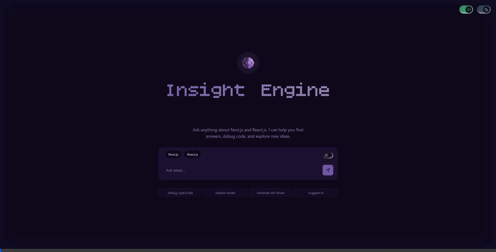
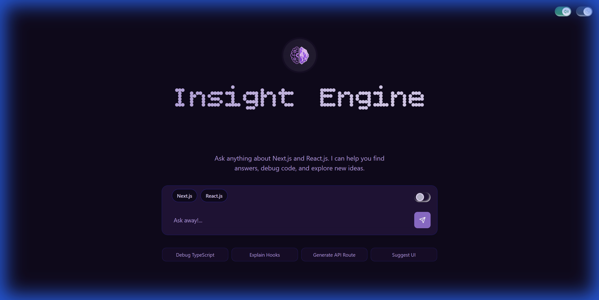
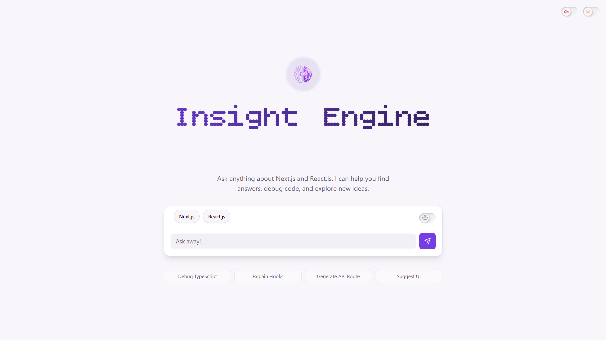
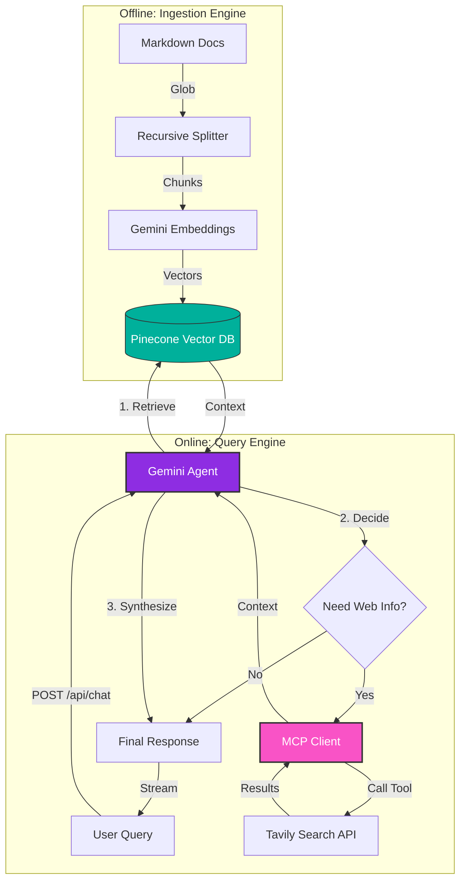

# 🧠 Insight Engine

**Insight Engine** is a high-performance RAG (Retrieval-Augmented Generation) application built to chat with documentation. It utilizes an "Offline Ingestion, Online Retrieval" architecture to provide accurate, context-aware answers while minimizing hallucinations.

---

## 👀 Preview



### Dark Mode
| **Landing** | **Chat** |
| :---: | :---: |
|  |  |

### Light Mode
| **Landing** | **Chat** |
| :---: | :---: |
|  |  |

---

## 🚀 Key Features

### 🎨 UI & Experience
- **Dark/Light Theme Toggle** - Switch themes with the toggle in the top-right corner
- **Sound Toggle** - Mute/unmute UI sounds (future feature)
- **Premium Aesthetic** - Cyberpunk-inspired design with dynamic glow effects
- **Dot-Matrix Typography** - Custom "Digital Decoding" title animation
- **Responsive Layout** - Centered initial view, transitioning to chat-history on interaction
- **Interactive Components** - Built with `shadcn/ui` for accessible, smooth interactions

### 🔍 Search Controls
- **Namespace Selection** - Filter by Next.js or React.js documentation
- **Web Search Toggle** - Enable Tavily web search for broader context

### 🤖 Intelligent Core
- **Agentic Tool Calling** - Autonomous decision making with Google's `mcpToTool` integration
- **Robust Failover** - Automatic retry logic handling rate limits (switches models on 429 errors)
- **Smart Ingestion** - Recursive globbing to discover documentation
- **Context-Aware Splitting** - LangChain recursive splitters for semantic integrity
- **Parallel Processing** - Batch & Throttle system respecting Gemini Free Tier limits
- **Semantic Search** - Pinecone serverless vectors with Cosine Similarity

---

## 🏗️ Architecture

The system uses a **Hybrid Agentic Architecture** combining offline vectorization with an online autonomous agent.



---

## 🛠️ Tech Stack

| Category | Technology |
| :--- | :--- |
| **Framework** | Next.js 16 (App Router) |
| **Styling** | Tailwind CSS v4, `shadcn/ui`, `lucide-react` |
| **Language** | TypeScript (Strict Mode) |
| **AI Models** | Gemini 2.0-flash (Agentic), `text-embedding-004` (Embeddings) |
| **Vector DB** | Pinecone (Serverless) |
| **Web Search** | Tavily API (via MCP) |
| **Agent Tools** | `@modelcontextprotocol/sdk`, Google GenAI `mcpToTool` |
| **Utilities** | `dotenv`, `glob`, `@langchain/textsplitters` |

---

## 📂 Project Structure

```bash
├── src
│   ├── app              # Next.js App Router pages
│   ├── components       # UI Components (shadcn/ui + custom)
│   │   ├── top-controls.tsx      # Theme & mute toggles
│   │   ├── namespace-buttons.tsx # Doc namespace selection
│   │   ├── web-search-toggle.tsx # Web search toggle
│   │   ├── chat-box.tsx          # Chat message display
│   │   └── chat-input.tsx        # Input with send button
│   ├── hooks            # Custom React hooks
│   │   └── use-title-animation.ts # Digital decoding effect
│   └── lib              # Utility functions & API clients
├── scripts
│   ├── ingest.ts        # Documentation ingestion pipeline
│   └── test-chat.ts     # CLI script for testing chat API
├── public
│   └── screenshots      # Preview images & demo
└── docs                 # Place your .md/.mdx documentation here
```

---

## ⚙️ Setup & Installation

### 1. Clone & Install
```bash
git clone https://github.com/your-username/insight-engine.git
cd insight-engine
npm install
```

### 2. Environment Secrets
Create a `.env.local` file in the root:
```bash
# Google AI Studio (Gemini)
GEMINI_API_KEY=AIzaSy...

# Pinecone Vector DB
PINECONE_API_KEY=pcsk_...

# Tavily Web Search (optional)
TAVILY_API_KEY=tvly-...
```

### 3. Prepare Data
Place your `.md` or `.mdx` files inside a `docs/` folder at the root.

---

## 🏃‍♂️ How to Run

### Ingestion (Offline)
Hydrate your vector database with your documentation.
```bash
npx tsx scripts/ingest.ts
```

### Development Server (Online)
Start the web application.
```bash
npm run dev
```
Visit `http://localhost:3000` to interact with Insight Engine.

### Testing
To test the chat API directly without the UI:
```bash
npx tsx scripts/test-chat.ts
```

---

## 💬 RAG Pipeline

**Agentic RAG Process**:
1. **Vectorization** - User input is embedded (`text-embedding-004`)
2. **Retrieval** - Queries Pinecone namespaces for documentation context
3. **Agentic Loop** - Gemini analyzes context and decides if web search is needed
4. **Tool Execution** - If needed, calls `tavily_search` via MCP to fetch real-time info
5. **Synthesis** - Combines docs + web info to generate grounded answer
6. **Streaming** - Response is streamed token-by-token to the UI


---

## 🎛️ Controls

| Control | Description |
| :--- | :--- |
| 🌙 **Theme Toggle** | Switch between dark and light mode |
| 🔊 **Mute Toggle** | Mute/unmute UI sounds (placeholder) |
| 🌐 **Web Search** | Enable Tavily web search for queries |
| 📚 **Namespace Buttons** | Filter by Next.js or React.js docs |

---

## 📝 License

MIT License - see [LICENSE](LICENSE) for details.
