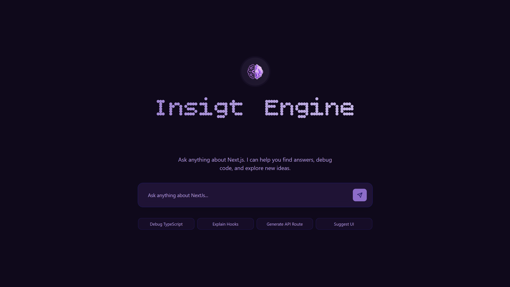
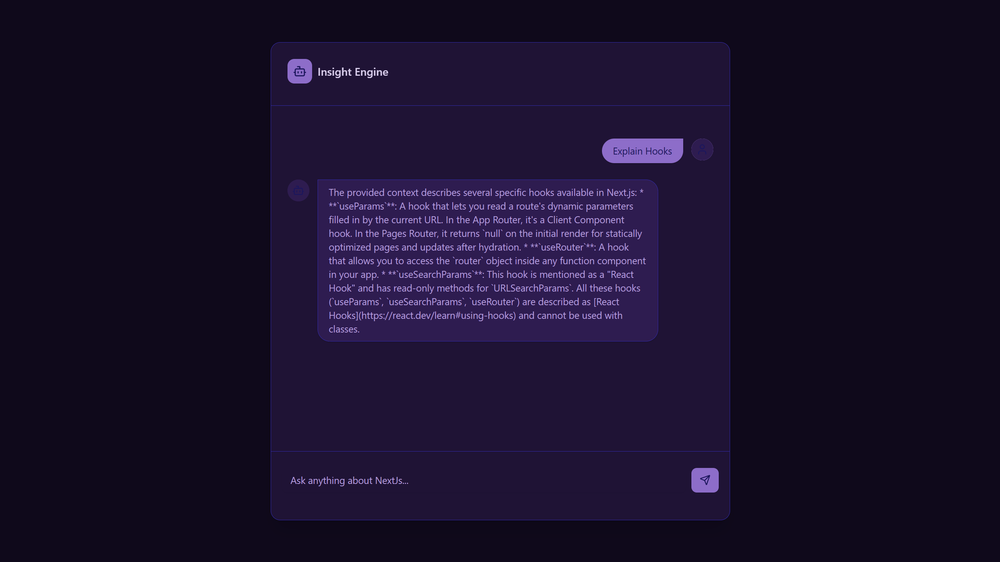

# 🧠 Insight Engine

**Insight Engine** is a high-performance RAG (Retrieval-Augmented Generation) application built to chat with documentation. It utilizes an "Offline Ingestion, Online Retrieval" architecture to provide accurate, context-aware answers while minimizing hallucinations.

---

## 👀 Preview

Experience a premium, responsive interface featuring a Cyberpunk-inspired aesthetic with dynamic glow effects and dot-matrix typography.

| **Home Interface** | **Chat Experience** |
| :---: | :---: |
|  |  |

---

## 🚀 Key Features

### 🎨 UI & Experience
*   **Premium Aesthetic**: Implements a "Cyberpunk" inspired dark mode with dynamic blue glow effects (`box-shadow` transitions).
*   **Dot-Matrix Typography**: Features a custom-styled "Insight Engine" title using dot-matrix font patterns for a unique retro-futuristic look.
*   **Responsive Layout**: The chat interface dynamically adjusts—starting centered and transitioning to a chat-history view upon interaction.
*   **Interactive Components**: Built with `shadcn/ui` components for accessible and smooth interactions (Inputs, Cards, Avatars).

### 🤖 Intelligent Core
*   **Smart Ingestion**: Uses recursive globbing to discover documentation across project folders.
*   **Context-Aware Splitting**: Utilizes LangChain recursive splitters to maintain semantic integrity of text segments.
*   **Parallel Processing**: Implements a "Batch & Throttle" system to respect Gemini Free Tier limits (100 RPM) while ensuring fast ingestion.
*   **Semantic Search**: Leverages Pinecone serverless vectors and Cosine Similarity for precise retrieval.

---

## 🏗️ Architecture

The project is split into two distinct workflows:

1.  **Ingestion Engine (Offline)**: A robust Node.js pipeline (`scripts/ingest.ts`) that reads, chunks, and indexes data.
2.  **Query Engine (Online)**: A Next.js API that retrieves context and generates answers in real-time.


---

## 🛠️ Tech Stack

| Category | Technology |
| :--- | :--- |
| **Framework** | Next.js 16 (App Router) |
| **Styling** | Tailwind CSS v4, `shadcn/ui`, `lucide-react` |
| **Language** | TypeScript (Strict Mode) |
| **AI Models** | Gemini 2.0-flash (Generation), `text-embedding-004` (Embeddings) |
| **Vector DB** | Pinecone (Serverless) |
| **Utilities** | `dotenv`, `glob`, `@langchain/textsplitters` |

---

## 📂 Project Structure

```bash
├── src
│   ├── app          # Next.js App Router pages
│   ├── components   # UI Components (shadcn/ui + custom)
│   └── lib          # Utility functions (utils.ts)
├── scripts
│   ├── ingest.ts    # Documentation ingestion pipeline
│   └── test-chat.ts # CLI script for testing chat API
├── public
│   └── screenshots  # Preview images
└── docs             # Place your .md/.mdx documentation here
```

---

## ⚙️ Setup & Installation

### 1. Clone & Install
```bash
git clone https://github.com/your-username/insight-engine.git
cd insight-engine
npm install
```

### 2. Environment Secrets
Create a `.env.local` file in the root:
```bash
# Google AI Studio (Gemini)
GEMINI_API_KEY=BIzaSy...

# Pinecone Vector DB
PINECONE_API_KEY=lcvk_...
```

### 3. Prepare Data
Place your `.md` or `.mdx` files inside a `docs/` folder at the root.

---

## 🏃‍♂️ How to Run

### Ingestion (Offline)
Hydrate your vector database with your documentation.
```bash
npx tsx scripts/ingest.ts
```

### Development Server (Online)
Start the web application.
```bash
npm run dev
```
Visit `http://localhost:3000` to interact with the Insight Engine.

### Testing
To test the chat API directly without the UI:
```bash
npx tsx scripts/test-chat.ts
```

---

## 💬 RAG Pipeline
**Grounded Retrieval Process**:
1.  **Vectorization**: User input is embedded (`text-embedding-004`).
2.  **Search**: Queries Pinecone `nextjs-docs` namespace.
3.  **Grounding**: Relevant chunks injected into System Prompt.
4.  **Generation**: Gemini 2.0-flash streams the answer.


